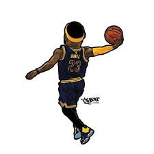

 <p align="center">
  <a href="http://jiahao.site/">
    
  </a>
</p>

<h1 align="center">ReDark</h1>

<div align="center">

一个基于 React 驱动的 UI 组件库 模板文件。

## 📦 先安装依赖

```bash
yarn
```

## 启动项目

```bash
yarn start
```

## 打包项目

```bash
yarn build
```

## 🔨 使用 redark 的组件

```jsx
import { Button } from '@rd'

const App = () => (
  <>
    <Button type="primary">PRESS ME</Button>
  </>
)
```

## 其他

模仿 antd 和 elmentui 打造的 自己写得玩的组件库。 还有很多不完善 ....

## 🔗 Links

[Home page](http://www.jiahao.site/)
